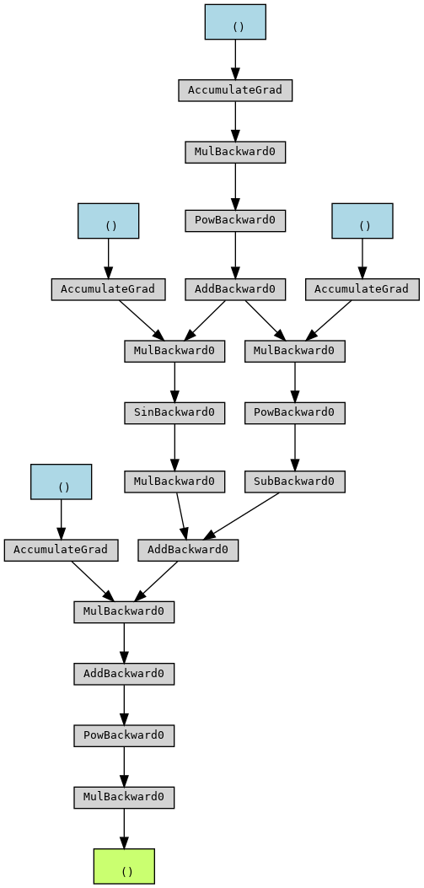

# Autograd support with PyTorch tensors

The training for neural network often involves gradient descent. In gradient decent, which is an optimization method to find as good as possible values for parameters, such that the function calculated by the network shall give "best" objective function. The idea is that we look at the current output of the network and compare it to the desired output (to the target). If we call the difference (or some related function) the error. Then we want to minimize the error.
We try to reduce the error a bit at any iteration. This process involves calculating gradients (partial derivaties).
For example, let's say this is our function:

$\hat{y} = a * x + 5$

Where $a$ is the parameter, and at the start $a = 1$. We get an example of $x = 1$, and $y = 7$. It is not there yet, as for us we get $1 * 1 + 5 = 6$. We note that $\frac{\partial a}{\partial y} = 1$ In other words, a tiny increase of $a$ say by $\epsilon a$, shall result in a matching increase in the output. Let's increase $a$ to $1.01$. Now we get $1.01 * 1 + 5 = 6.01$ which is indeed closer to the target. We actually work usually on the error, for example $a * x + 5 - 7$, calculate what will make it higher and go the other direction. The idea is the same.
The derivatives are often more involved from above, as of multiple neurons, non-linearity, and as of composite functions. When a neuaral network is composed of multiple layers, this is basicly a composition of functions; $L2(L1(Input))$ and so. Calculating derivatives for composite functions is done usually with the help of the chain-rule, yet still involves a lot of calculations and is confusing.

With neural networks of many parameters, we first calculate the gradients with respect to the error (or loss), for all the parameters, then change accordingly at the same time, a bit for each of the relevant parameters proportional to its gradient wrt the loss. As said above, coming up with the right formula of the partial derivates for all the parameters can be confusing and error prone. Luckily for us, with PyTorch we have a built-in support in the tensors, so that when you calculate a new tensor based on existing tensors, the existing tensors keep track of the gradients that are relevant to the calculation.

``` py
# Create a tensor and indicate that we want to compute gradients
x = torch.tensor(1.0, requires_grad=True)

# Define a function of x
y = x ** 2

# Compute the gradient of y with respect to x
y.backward()

# The gradient is stored in x.grad
print(x.grad)  # Output: tensor(2.)
```

If we continue the example from above:

``` py
y2 = x ** 3
y2.backward()
print(x.grad)
```

```tensor(5.)```

It seems that the gradients for $x$ were accumulated. Therefore we got both the gradients due to $y$ as well as those due to $y2$.

To reset and start from fresh:

``` py
y2 = x ** 3
x.grad = None
y2.backward()
print(x.grad)
```

```tensor(3.)```

The calculations can be more involved, and as hinted above, involve multiple tensors and composed as in:

``` py
p1 = torch.tensor(1.0, requires_grad=True)
p2_1 = torch.tensor(2.0, requires_grad=True)
p2_2 = torch.tensor(3.0, requires_grad=True)
p3 = torch.tensor(1.5, requires_grad=True)

x = 3
o1 = (p1 * x) ** 2 + 1
o2_1 = (p2_1 * o1) ** 0.5 - 4 
o2_2 = (p2_2 * o1).sin()
o3 = (p3 * (o2_1 + 2 * o2_2) + 9) ** 0.3
y = 8 * o3
y.backward()

print(p1.grad)
print(p2_1.grad)
print(p2_2.grad)
print(p3.grad)
```

```
tensor(19.5745)
tensor(1.0581)
tensor(2.9195)
tensor(-0.9488)
```

It seems to be right? No? You are welcome to verify. ```:)```

With the following code (after pip installing *torchviz*):

``` py
from torchviz import make_dot

# Visualize the computation graph
make_dot(y).render("computation_graph", format="png")
```

I've got the following picture:

<figure style="width:60%">
    
    <figcaption>Computation graph for y</figcaption>
</figure>

For PyTorch models, one can use *tensorboard* to visualize the computation graphs (yes tensorboard supports also PyTorch). I was not able to achieve above on a "stand alone" tensor. It complained that the tensor does not have the attribute *training*, which is correct, yet probably not the intended outcome.

While we haven't talked yet about neural networks, neighter about optimizers, and also not about data loaders, I'm bringing here a typical training loop, just to put in context *autograd* and *backward*.

``` py
...

# Training loop
num_epochs = 10
for epoch in range(num_epochs):
    running_loss = 0.0
    for i, data in enumerate(train_loader):
        # Get the inputs; data is a list of [inputs, labels]
        inputs, labels = data

        # Zero the parameter gradients
        optimizer.zero_grad()

        # Forward pass
        outputs = model(inputs)
        loss = criterion(outputs, labels)

        # Backward pass and optimize
        loss.backward()
        # here the optimizer shall change the relevant model's parameters
        optimizer.step()

        # Print statistics
        running_loss += loss.item()
        if i % 100 == 99:  # Print every 100 mini-batches
            print(f"[{epoch + 1}, {i + 1}] loss: {running_loss / 100:.3f}")
            running_loss = 0.0

print("Finished Training")
```