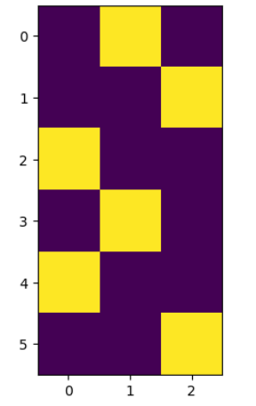

# Embeddings

In my mind embeddings are just a synonym for features. For example, if we had:

``` py
linear = nn.Linear(in_features=5, out_features=10)
```

Then the input, x, for the call ```linear(x)``` should have in its last dimension exactly 5 float numbers that represent that entity.

``` py
input = torch.rand((30, 5))
output = linear(input)

print(output[0:2])
```

```
tensor([[-0.7293, -0.1951,  0.5209,  0.5675, -0.1038,  0.5577,  0.5348, -0.4421,
          1.0414,  0.5022],
        [-0.6138, -0.2785,  0.1877,  0.5519, -0.1119,  0.3371,  0.4090, -0.5615,
          1.0520,  0.3136]], grad_fn=<SliceBackward0>)
```

The five numbers, in the example above, can be, for example the following features about a person: *age*, *num children*, *height*, *mark in math test*, and *lucky number*; All represented as float numbers. We can also say that actually the output (10 numbers in the example above), are the representation of the person. While we've lost the "interpretability", this is still valid. We start with the original features, pass them through the linear layer, and we wind up with a continues (float numbers) representation that mixed everything together.

Usually embeddings are a way to represent high-dimensional data in a lower-dimensional space, so not from 5 numbers to 10, but rather, as an example, from an image of 800 x 600 x 3 integer values to say 128 float numbers (so not just flatening the image into a long vector but more than that). Another example is taking variable length text (for example 1,000-2,000 characters), and returning 100 float numbers. Also representing categorical values, such as country name. So instead of country name, there will be say 4 float numbers.  
We could have also use one-hot-encoding in the example of the country name, meaning 1 for the relevant entry, and 0 everywhere else. Going even a step backwards, we could have just represent each country name by a unique number.  
What is the benefit of a float, dense, representation (as opposed to the one-hot-encoding sparsity)? With dense representation we can commit to a fix length vector. Also operations down the line, will be anyway with floats (for example the linear layer above). With dense vector, the representation is "distributed" among the entries. We should get some robustness to small changes in the values and we should get generality. The representation can and should be somewhat meaningful for the relevant task down the line.  
Making out of inputs of various shapes and nature, a vector of float numbers, is also refered as *vectorization*. Vectorization is then also the speed-up gained by operating on multiple entries at the same time using tensors operations, with the relevant linear-algebra packages / built-in support, we use.

## Embedding as the outputs of "before last" layer

How do we find the "right" embeddings for our inputs? One approach would be that finding the embeddings is part of the training. We start with the original pixel values of an image as an example, then down the line the various layers calculate values, and those are being improved with the training (when doing the backward pass). We can then say that the output of one or more of the layers is the embedding of the image. So the "features" were figured out automatically, and we can either examine those, or just accept them as are, and focus on the performance of the model as a whole.

``` py
import torch
import torch.nn as nn
import torch.optim as optim
import torch.nn.functional as F
from torchvision import datasets, transforms
from torch.utils.data import DataLoader


class SimpleCNN(nn.Module):
    def __init__(self):
        super(SimpleCNN, self).__init__()
        self.conv1 = nn.Conv2d(1, 32, kernel_size=3, padding=1)
        self.conv2 = nn.Conv2d(32, 64, kernel_size=3, padding=1)
        self.fc1 = nn.Linear(64*7*7, 128)
        self.fc2 = nn.Linear(128, 10)  # Assuming 10 classes for classification

    def forward(self, x):
        x = F.relu(self.conv1(x))
        x = F.max_pool2d(x, 2)
        x = F.relu(self.conv2(x))
        x = F.max_pool2d(x, 2)
        x = x.view(-1, 64*7*7)
        x = F.relu(self.fc1(x))
        embeddings = x  # This is the layer before the last
        x = self.fc2(embeddings)
        return x, embeddings


transform = transforms.Compose([
    transforms.ToTensor(),
    transforms.Normalize((0.5,), (0.5,))
])

train_dataset = datasets.MNIST(root='./data', train=True, download=True, transform=transform)
train_loader = DataLoader(train_dataset, batch_size=64, shuffle=True)

model = SimpleCNN()
criterion = nn.CrossEntropyLoss()
optimizer = optim.Adam(model.parameters(), lr=0.001)

for epoch in range(5):  # Train for 5 epochs
    for data, target in train_loader:
        optimizer.zero_grad()
        output, _ = model(data)
        loss = criterion(output, target)
        loss.backward()
        optimizer.step()

model.eval()
with torch.no_grad():
    for data, _ in train_loader:
        _, embeddings = model(data)
        print(embeddings.shape)  # This will print the shape of the embeddings
        print(embeddings[1])  # Print the embeddings of the first image
        break  # Just to demonstrate, we break after the first batch
```

```
torch.Size([64, 128])
tensor([ 0.0000,  1.1136,  0.0000,  0.0000,  5.8238,  0.0000,  5.3606,  0.0000,
         0.0000,  0.0000,  3.7185,  0.0000,  0.0000,  3.8186,  0.0000,  7.1503,
         0.0000,  0.0000,  0.1049, 12.1226,  0.0000,  0.0000,  0.0000,  0.0000,
         6.4292,  0.0000,  0.0000,  8.9185,  0.0000,  1.5302,  0.0000,  7.0113,
         0.0000,  5.6367,  5.8558,  0.1248,  0.0000,  0.0000,  0.0000,  0.0000,
         0.0000,  0.0000,  0.0000,  0.0000,  5.0979,  0.1330,  0.0000,  0.0000,
         0.0000,  0.0000,  0.0000,  0.0000,  0.0000,  0.6371,  3.5945,  0.0000,
         0.0000, 15.4092,  0.0000,  0.0000,  2.8716,  3.0890, 20.2494,  0.0000,
         0.0000,  0.0000,  0.0000,  9.1179,  0.0000,  0.0000,  0.0000,  0.0000,
         0.0000,  0.0000,  7.2256,  2.6913,  0.0000,  0.1845, 11.2452,  0.0000,
         6.1028,  0.0000,  0.0000,  0.0000,  0.0000,  0.0000,  0.0000,  0.2460,
         0.0000,  0.0000,  0.0000,  0.0000,  0.0000,  7.6430,  0.0000,  1.2241,
         0.0000,  0.0000,  0.9366, 13.4370,  2.0505,  2.9676,  0.0000,  0.0000,
         0.0000,  3.3068, 13.7987,  0.0000,  0.0000,  0.0000,  0.0000,  0.0000,
         0.0000,  0.0000,  0.0000,  0.0000,  0.0000,  0.0000,  0.0000,  4.2009,
         0.0000,  0.0000,  0.0000,  2.5552,  0.0000,  0.0000, 11.6470,  0.0000])
```

We use CNN which is often done with images, it is like a filter that is "passed" across the image and generates a new "image", and so the same parameters of the filter are used in multiple places to try to see if the (same) signal is present there. So for example if you search for a human face, in the output "image" you can see high-likelihood in multiple places (maybe indeed there are multiple people in the image).  
We see above also ```view``` which is like ```reshape``` and is used to "flatten" the matrix into a vector. We see that ```forward``` returns not only the output, but also the value that we got in a previous layer (the input to ```fc2```). We can do that when we have access to the class of the model and we know that we want to have the "embeddings". We then need to remember that the output is a tuple which includes also the embeddings. Also interesting to see the many zeros in the embeddings. The zeros can be thought of as turned-off features (things that are not present in the image). 

## Embedding from a pre-trained model

Another way, can be to rely on an existing, pre-trained model, to feed it our input, and to collect the embeddings either at the last layer (the pre-trained model), or from one of the layers that preceed the output. We then take the embeddings to be the input to our model. Hopefully the embedding "logic" is somewhat relevant to our task, and so our model can make use of its input (the embeddings) and learn the desired task.

``` py
from transformers import BertModel, BertTokenizer

# Load pre-trained model and tokenizer
model_name = 'bert-base-uncased'
tokenizer = BertTokenizer.from_pretrained(model_name)
model = BertModel.from_pretrained(model_name)

# Example text
text = "Hello, how are you?"

# Tokenize the text
inputs = tokenizer(text, return_tensors='pt')

# Get the embeddings
with torch.no_grad():
    outputs = model(**inputs)

# The embeddings are in the last hidden state
embeddings = outputs.last_hidden_state

print(embeddings.shape)
print(embeddings.squeeze())
```

```
torch.Size([1, 8, 768])
tensor([[-0.0824,  0.0667, -0.2880,  ..., -0.3566,  0.1960,  0.5381],
        [ 0.0310, -0.1448,  0.0952,  ..., -0.1560,  1.0151,  0.0947],
        [-0.8935,  0.3240,  0.4184,  ..., -0.5498,  0.2853,  0.1149],
        ...,
        [-0.2812, -0.8531,  0.6912,  ..., -0.5051,  0.4716, -0.6854],
        [-0.4429, -0.7820, -0.8055,  ...,  0.1949,  0.1081,  0.0130],
        [ 0.5570, -0.1080, -0.2412,  ...,  0.2817, -0.3996, -0.1882]])
```

We are using above the BERT model. We've used the ```transformers``` package from HuggingFace.
From the original text "Hello, how are you?" we winded up with 8 tokens, and each got a 768 representation. How to go from there to the task, for example, does the text contain humour? If I understand correct, then from the text we got 6 tokens: ["Hello", ",", "how", "are", "you", "?"], then two tokens where added, one at the start: [CLS], and another at the end [SEP]. We got 8 (token level) embeddings. From there we can either use only the first one (the one for the [CLS]), or we can consider the average as the "sentense level" embeddings:

``` py
# Get the embeddings for the [CLS] token
cls_embedding = embeddings[:, 0, :]

# Or average the token embeddings
sentence_embedding = embeddings.mean(dim=1)
```

One can then use above embeddings and train a classifier:

``` py
import torch.nn as nn


class HumorClassifier(nn.Module):
    def __init__(self):
        super(HumorClassifier, self).__init__()
        self.linear = nn.Linear(768, 1)
    
    def forward(self, x):
        return torch.sigmoid(self.linear(x))


classifier = HumorClassifier()


# ... obtain here texts and matching labels
# ... obtain here embeddings for the texts


criterion = nn.BCELoss()
optimizer = optim.Adam(classifier.parameters(), lr=0.001)

# Convert labels to tensor
labels = torch.tensor(labels, dtype=torch.float32).unsqueeze(1)

# Training loop
for epoch in range(100):
    optimizer.zero_grad()
    outputs = classifier(embeddings)
    loss = criterion(outputs, labels)
    loss.backward()
    optimizer.step()
    print(f'Epoch {epoch+1}, Loss: {loss.item()}')
```

We can also package the embedding part and even simplify some more, the process of getting the (say 768 floats) representation:

``` py
from sentence_transformers import SentenceTransformer


model = SentenceTransformer('paraphrase-MiniLM-L6-v2')

# Sentences we want to encode. Example:
sentence = ['This framework generates embeddings for each input sentence']

# Sentences are encoded by calling model.encode()
embedding = model.encode(sentence)
```

There is an alternative to above approach, which is refered to as fine-tuning. In the setting of fine-tuning we also start with an existing model (that was pre-trained), but then we train it entirely, or partly (some of the layers), on the target task (transfer learning). This is a bit less related to embeddings, but I wanted to bring it here in the context of using pre-trained models.

## Embeddings from Auto-Encoder

Embedding can come from an "auto-encoder" process, in which we try to "compress" the information and then see if we can reco0nstract the original input. This can be achieved from unsupervised data, and thus allows us to use big quantities to examples (that we're collected for example from the WWW).

``` py
import torch
import torch.nn as nn
import torch.nn.functional as F
import torch.optim as optim
from torchvision import datasets, transforms

# Define the autoencoder class
class Autoencoder(nn.Module):
    def __init__(self):
        super(Autoencoder, self).__init__()
        self.encoder = nn.Sequential(
            nn.Linear(28 * 28, 128),
            nn.ReLU(),
            nn.Linear(128, 64),
            nn.ReLU(),
            nn.Linear(64, 12),
            nn.ReLU(),
            nn.Linear(12, 6)  # Bottleneck layer
        )
        self.decoder = nn.Sequential(
            nn.Linear(6, 12),
            nn.ReLU(),
            nn.Linear(12, 64),
            nn.ReLU(),
            nn.Linear(64, 128),
            nn.ReLU(),
            nn.Linear(128, 28 * 28),
            nn.Sigmoid()
        )

    def forward(self, x):
        x = self.encoder(x)
        x = F.sigmoid(x)
        x = self.decoder(x)
        return x

# Load the dataset
transform = transforms.Compose([transforms.ToTensor(), transforms.Normalize((0.5,), (0.5,))])
trainset = datasets.MNIST(root='./data', train=True, download=True, transform=transform)
trainloader = torch.utils.data.DataLoader(trainset, batch_size=64, shuffle=True)

# Initialize the model, loss function, and optimizer
model = Autoencoder()
criterion = nn.MSELoss()
optimizer = optim.Adam(model.parameters(), lr=0.001)

# Training loop
for epoch in range(10):  # Train for 5 epochs
    for data in trainloader:
        inputs, _ = data
        inputs = inputs.view(-1, 28 * 28)  # Flatten the images

        # Forward pass
        outputs = model(inputs)
        loss = criterion(outputs, inputs)

        # Backward pass and optimization
        optimizer.zero_grad()
        loss.backward()
        optimizer.step()

    print(f'Epoch [{epoch+1}/5], Loss: {loss.item():.4f}')

print("Training complete!")
```

```
Epoch [1/5], Loss: 0.9208
Epoch [2/5], Loss: 0.9284
Epoch [3/5], Loss: 0.9289
Epoch [4/5], Loss: 0.9180
Epoch [5/5], Loss: 0.9259
Epoch [6/5], Loss: 0.9170
Epoch [7/5], Loss: 0.9078
Epoch [8/5], Loss: 0.9036
Epoch [9/5], Loss: 0.9026
Epoch [10/5], Loss: 0.9000
Training complete!
```

Above seems to make some progress; smaller and smaller loss. The embeddings that I had in mind, are the output after the encoder (6 floats).

There are multiple other ways to achieve meaningful embeddings that are a result of some smart training, usually from unsupervised dataset (for example collecting texts from the web and learning what is the next word). Assume you maintain a dictionary. You limit the dictionary to 100,000 words, maybe reserving one entry for all other words. Then each entry has a matching index. So for example 'hello' gets 7 and 'world' gets 88, so 'hello world' is represepted by 7, 88. Then this is often first converted to one-hot-encoding (sparse representation), but the next layer may learn dense representation, such that finaly 'dog' is closer to 'cat' than to 'airplaine' in the space of the embeddings, and wrt some distance measure.

## Embedding for a categorical column

Below I want to bring an example of "learning" dense embeddings with PyTorch for a categorical column. If I understand correct, there is no special support for maintaining the dictionary and coming up with appropriate index. One uses regular Python for that. Once you have the indices, PyTorch helps with the assembly of one-hot-encoding and from there the  dense representation and the training process.

``` py
import pandas as pd

# Example categorical column
data = {'category': ['cat', 'dog', 'bird', 'cat', 'bird', 'dog']}
df = pd.DataFrame(data)

# Create a unique index for each category
df['category_index'] = df['category'].astype('category').cat.codes
print(df)
```

```
  category  category_index
0      cat               1
1      dog               2
2     bird               0
3      cat               1
4     bird               0
5      dog               2
```

``` py
import torch
import torch.nn.functional as F

# Convert category indices to one-hot encoding
num_classes = df['category_index'].nunique()
one_hot = F.one_hot(torch.tensor(df['category_index']).to(torch.int64), num_classes=num_classes)
print(one_hot)
```

```
tensor([[0, 1, 0],
        [0, 0, 1],
        [1, 0, 0],
        [0, 1, 0],
        [1, 0, 0],
        [0, 0, 1]])
```

```
import matplotlib.pyplot as plt

plt.imshow(one_hot)
```

<figure style="width:30%">
    
    <figcaption>One-Hot-Encoding</figcaption>
</figure>

Now look at the following and imagine that, we can train this model for a few iterations on our task, and get useful embeddings mapping from indices, that shall enable the learning of the task.

``` py
import torch.nn as nn

class SimpleModel(nn.Module):
    def __init__(self, num_classes, embedding_dim):
        super(SimpleModel, self).__init__()
        self.embedding = nn.Embedding(num_classes, embedding_dim)
        self.fc = nn.Linear(embedding_dim, 1)  # Example output layer

    def forward(self, x):
        embedding = self.embedding(x)
        x = self.fc(embedding)
        return x, embedding


# Instantiate and test the model
model = SimpleModel(num_classes=num_classes, embedding_dim=4)
output, embeddings = model(torch.tensor(df['category_index']).to(torch.int64))
print(output)
print()
print(embeddings)
```

```
tensor([[-1.1242],
        [ 0.0574],
        [-0.7675],
        [-1.1242],
        [-0.7675],
        [ 0.0574]], grad_fn=<AddmmBackward0>)

tensor([[-0.5776,  0.3355,  2.3085, -0.1005],
        [-0.0302,  0.7318, -1.4959, -0.7707],
        [-1.1924,  0.0649,  1.2808,  2.1736],
        [-0.5776,  0.3355,  2.3085, -0.1005],
        [-1.1924,  0.0649,  1.2808,  2.1736],
        [-0.0302,  0.7318, -1.4959, -0.7707]], grad_fn=<EmbeddingBackward0>)
```

Above, the ```nn.Embedding``` layer contains the one-hot-encoding logic, so its input is actually the index as an ```torch.int64``` value.

