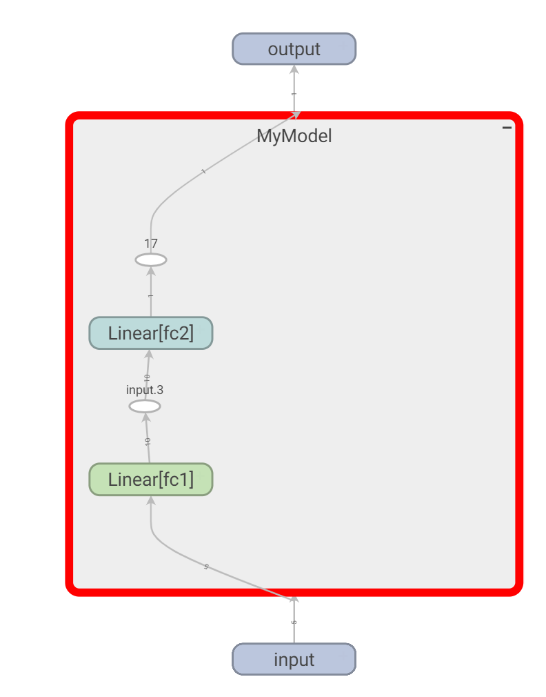
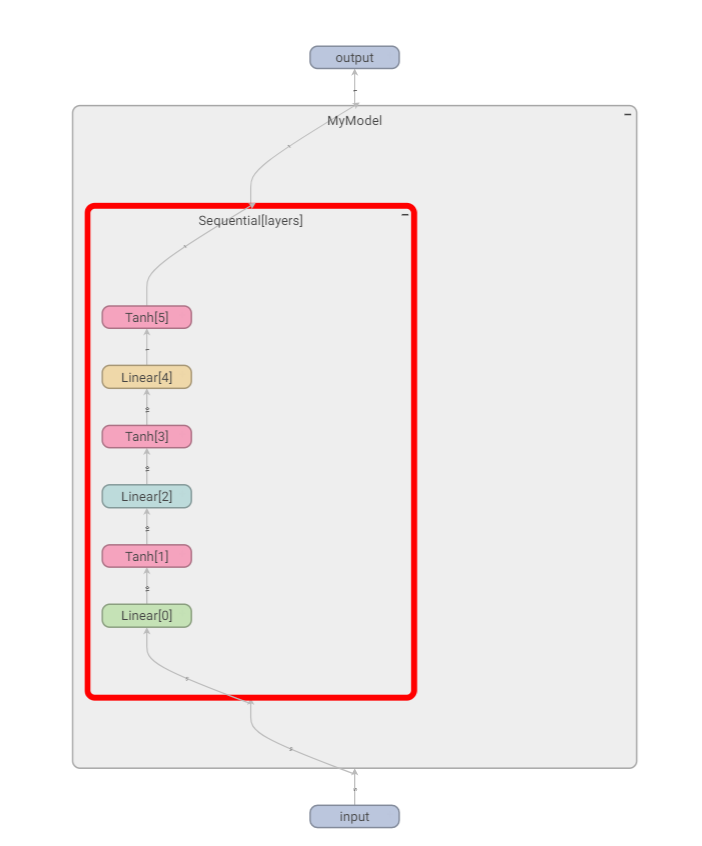

# Neural Networks with PyTorch

We're already seen tensors. Imagine a calculation, where at one side you have inputs, or readings from a sensor etc. At the other side of the calculation (the results) is a prediction, or a decision, or also some other desired output (such as a text describing in plain English what we see in the input image).
The claim of neural networks (NN), is that such setting can be realized with a tensor or often multiple tensors, operating on the input(s), with potentially more mathematical operations on the way, and the output shall indeed be what we need it to be.

Compare this way of thinking about a challenge to be automated, to traditional rule-based systems. Just a long, complicated and composed as needed, but with NN, just a feed-forward calculation. Compared above to a series of (nested) if-then-else and relevant logic. To be really honest, the calculations of a NN involve functions that "contain" if-like logic, such as *.abs*, *.clip*, and more. Also the rule-based solutions start with processing the inputs and extracting statistics and "features", such as: "number of words on avarage in each sentence", or "total sum of purchases that month", etc.

The magic for a NN happens when the tensors contain the right values in each of their entries. All those values in the tensors, work together, as to "extract statistics and features" from the input(s), pass those throught the "if-like" logic, and output the desired result. Unlike traditional programming, filling the right values in the tensors, is done by a training algorithm (optimization) rather than by setting those following a clever analytics.

While we could work with bare tensors, PyTorch has higher level construct *nn.Module*.

``` py
import torch
from torch import nn
from torch.nn import functional as F


class MyModel(nn.Module):
    def __init__(self):
        super(MyModel, self).__init__()
        self.fc1 = nn.Linear(5, 10)
        self.fc2 = nn.Linear(10, 1)

    def forward(self, x):
        x = self.fc1(x)
        x = F.tanh(x)
        x = self.fc2(x)
        return F.tanh(x)


model = MyModel()

out = model(torch.rand(5))
print(out)
print(out.shape)
```

```
tensor([0.0552], grad_fn=<TanhBackward0>)
torch.Size([1])
```

Above, we've derived a new class from *nn.Module*. Our NN model is a *nn.Module*. We'll have a couple of attributes to each instance, that is in the example *fc1* and *fc2*. In the constructor, those are just created and saved for later. *nn.Linear* is basicly two tensors. In the example of *fc1*, one of size [10, 5] and the other of size [10] (bias).
The operation implied by *nn.Linear* is basically *matmul* bewteen the first tensor and the input we then add the bias tensor. *fc* stands for "fully connected", this name is used often for *nn.Linear*. The internal modules are the "layers" of the neural network.

``` py
model.fc1.state_dict()
```

```
OrderedDict([('weight', tensor([[-0.1497, -0.2375,  0.1056, -0.3654,  0.3629],
        [ 0.0529,  0.3939, -0.0946,  0.3917,  0.3135],
        [-0.3274, -0.0793,  0.1388,  0.2727, -0.3741],
        [ 0.2795, -0.2330, -0.0990,  0.4247,  0.4342],
        [ 0.1221,  0.2291, -0.1657,  0.4082,  0.2261],
        [ 0.2819,  0.4004, -0.4413,  0.0400,  0.4329],
        [ 0.2175,  0.0362,  0.2990,  0.3109, -0.2700],
        [ 0.2692, -0.3269, -0.3591, -0.0944, -0.2211],
        [ 0.2267, -0.4393,  0.3136,  0.2568,  0.0721],
        [-0.3871, -0.3472, -0.1821, -0.4447,  0.2364]])), ('bias', tensor([-0.1682, -0.3213,  0.2310, -0.2638,  0.4306,  0.0138, -0.0102, -0.2979,
        -0.2500, -0.3362]))])
```

The values of the tensors where randomly initialized.

*nn.Linear* is by itself an *nn.Module*:

``` py
isinstance(model.fc1, nn.Module)
```

```True```

It is nice that we compose *nn.Module* of other modules, as we can define custom "building blocks" and use them later as part of a NN model (imagine you want to repeat a construct a few times). It makes everything more "modular".

In *forward* we make use of the internal *layers* on the module. We pass the input throught them and let them do their calculations. In the example above we broke the linearity between *fc1* and *fc2* using *tanh*. *tanh* does not have parameters, and so we did not need to allocate attributes in the constructor, but rather using it from *torch.nn.functional*, which is a collection of functions. Another name for those non-linearity functions is *activation functions*.

Note that when we use the model above ```out = model(torch.rand(5))```, we've "called" the model which in turns calls *forward*. We passed a single input, this was the expected input, a vector of 5 elements. We can also pass a mini-batch of inputs ```out = model(torch.rand(5).unsqueeze(0))```.
The output in the first case is ```torch.Size([1])``` and in the mini-batch one is ```torch.Size([1, 1])```. I think we've have single element / mini-batch for free as of the broadcast capabilities of tensors. One can also have a mini-batch of mini-batches (if makes sense) etc.

Note that the tensors where defined as ones that require *autograd*. This means that when we use the result of the network, potentially calculating the loss from the result and some desired output, we can *backward* the gradient to all relevant calculations that were used for the loss and internally in the *forward* implementation.

Printing the model will yield something as follows.

```
MyModel(
  (fc1): Linear(in_features=5, out_features=10, bias=True)
  (fc2): Linear(in_features=10, out_features=1, bias=True)
)
```

Note that the graph is aware of the names of the attributes as we named them in the initialization.  
With tensorboard, I got the following diagram:

``` py
# make sure first to "pip install tensorboard"
from torch.utils.tensorboard import SummaryWriter

writer = SummaryWriter()
writer.add_graph(model, torch.rand(5))
writer.close()
# now open tensorboard --logdirs=runs and check for the graph of the latest run
```

<figure style="width:60%">
    
    <figcaption>Computation graph for model</figcaption>
</figure>

One can add the non-linearity also to the graph with a bit more attributes to the model:

```py
class MyModel(nn.Module):
    def __init__(self):
        super(MyModel, self).__init__()
        self.fc1 = nn.Linear(5, 10)
        self.nl1 = nn.Tanh()
        self.fc2 = nn.Linear(10, 1)
        self.nl2 = nn.Tanh()

    def forward(self, x):
        x = self.fc1(x)
        x = self.nl1(x)
        x = self.fc2(x)
        return self.nl2(x)


model = MyModel()
```

*nn.Module* brings some more goodies. For example, while we've added attributes to our class, those "parameters" where also noted, and are currently available (see above usage of ```state_dict```).

``` py
list(model.parameters())
```

```
[Parameter containing:
 tensor([[ 0.2207,  0.1466, -0.3568, -0.2860, -0.0585],
         [-0.1582,  0.1217, -0.0859,  0.1306,  0.1662],
         [-0.0158,  0.4182, -0.3181,  0.0978, -0.1387],
         [ 0.1375,  0.3619,  0.2441, -0.3241, -0.0193],
         [-0.1960,  0.4269, -0.2684,  0.0177,  0.4463],
         [-0.1160, -0.0506, -0.2181,  0.1954,  0.2758],
         [-0.3748,  0.1646, -0.1075, -0.1940, -0.4468],
         [ 0.3785,  0.1593, -0.3964, -0.0366, -0.2333],
         [ 0.1707, -0.0325, -0.0823,  0.0911, -0.3582],
         [ 0.1998, -0.1256,  0.2642, -0.2502,  0.2250]], requires_grad=True),
 Parameter containing:
 tensor([ 0.0451,  0.3004, -0.0041,  0.4164, -0.0115, -0.3451, -0.3801, -0.1956,
         -0.1690,  0.3703], requires_grad=True),
 Parameter containing:
 tensor([[ 0.1877, -0.3158,  0.0916,  0.1542,  0.1127,  0.0930,  0.1966,  0.2425,
           0.0706,  0.2424]], requires_grad=True),
 Parameter containing:
 tensor([0.2331], requires_grad=True)]
```

Values above may differ as I ran the snippet in another opportunity.  
The ability to have the ```state_dict``` of a model will help us when we want to save a copy of a model on disk. If we fail to save the parameters, we'll need to train and verify each time we need such a model. The real value of a model is one that was trained and gave us good results on unseen dataset.  
```parameters``` will be useful for us when we want to select what parameters to train / fine-tune.

Please note that a ```nn.Module``` is aware only of other ```nn.Module`` that is an attribute of the object. Not sure how this wonderful capability was achieved in the first place, yet we do need to be aware of it. Let's try the following:

``` py
class MyModel(nn.Module):
    def __init__(self, num_layers=3):
        super(MyModel, self).__init__()
        self.layers = []
        in_features = 5
        out_features = 10
        for _ in range(num_layers - 1):
            self.layers.append(nn.Linear(in_features, out_features))
            in_features = out_features   
        self.layers.append(nn.Linear(in_features, 1))

    def forward(self, x):
        for layer in self.layers:
            x = layer(x)
            x = F.tanh(x)
        return x


model = MyModel()
model.state_dict()
```

```OrderedDict()```

The funny part, is that above mostly do work:

``` py
model(torch.rand(5))
```

```tensor([-0.3304], grad_fn=<TanhBackward0>)```

Easy solution for above is to use ```nn.ModuleList```

```
class MyModel(nn.Module):
    def __init__(self, num_layers=3):
        super(MyModel, self).__init__()
        layers = []
        in_features = 5
        out_features = 10
        for _ in range(num_layers - 1):
            layers.append(nn.Linear(in_features, out_features))
            in_features = out_features   
        layers.append(nn.Linear(in_features, 1))
        self.layers = nn.ModuleList(layers)

    def forward(self, x):
        for layer in self.layers:
            x = layer(x)
            x = F.tanh(x)
        return x


model = MyModel(2)
model.state_dict()
```

```
OrderedDict([('layers.0.weight',
              tensor([[ 0.3956, -0.3880,  0.4201, -0.1354, -0.1536],
                      [ 0.1374,  0.0503,  0.0612,  0.0231,  0.1588],
                      [-0.0798, -0.2296, -0.0735,  0.3649,  0.3362],
                      [ 0.2273,  0.3117,  0.1105, -0.0899,  0.3984],
                      [-0.2068, -0.1243, -0.0746, -0.0251,  0.0485],
                      [-0.1613, -0.2822, -0.2108, -0.1591,  0.0344],
                      [ 0.0259, -0.3709, -0.3758, -0.1356,  0.3477],
                      [-0.3030,  0.0275, -0.3157,  0.1007,  0.2047],
                      [-0.0222,  0.0705,  0.2005, -0.3808, -0.0279],
                      [ 0.0557,  0.2277,  0.3824, -0.3172,  0.1456]])),
             ('layers.0.bias',
              tensor([ 0.2578, -0.0806,  0.1190,  0.2998,  0.2751,  0.1743,  0.2498, -0.1855,
                      -0.3150,  0.1348])),
             ('layers.1.weight',
              tensor([[ 0.0866, -0.0983, -0.1061, -0.1938,  0.2220, -0.0435, -0.1673,  0.2343,
                       -0.1903, -0.2391]])),
             ('layers.1.bias', tensor([0.0450]))])
```

One can also use ```nn.Sequential``` which includes also the cascading loop.

```
class MyModel(nn.Module):
    def __init__(self, num_layers=3):
        super(MyModel, self).__init__()
        self.layers = nn.Sequential()
        in_features = 5
        out_features = 10
        for _ in range(num_layers - 1):
            self.layers.extend([nn.Linear(in_features, out_features), nn.Tanh()])
            in_features = out_features   
        self.layers.extend([nn.Linear(in_features, 1), nn.Tanh()])
        

    def forward(self, x):
        return self.layers(x)


model = MyModel()
```

<figure style="width:60%">
    
    <figcaption>Sequential (as shown on tensorboard if you add the graph of the model)</figcaption>
</figure>
