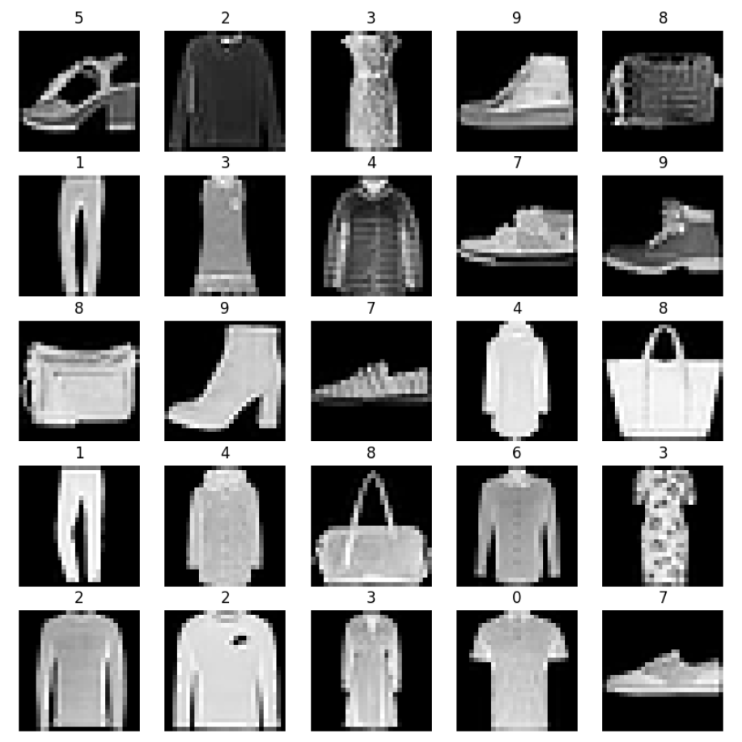

# Training

We already have a model, which knows to feed-forward some input(s) in a specific size (shape) and return specific size output(s). We've seen an easy and modular way to define those, in a way that keeps track of all our parameters, and that calculate for us partial derivatives, needed for gradient descent.  
We need now a training dataset. A dataset can be given for example as a tensor with the appropriate dimensions and size. The first dimension can be the instance (data item), so that we actually get a batch of our examples. For simplicity of the discussion, let's assume we're in supervised setting, that means that for every entry in the batch we have also a label.

``` py
import torch
from torch import nn
from torch.nn import functional as F


def get_dataset():
    X = torch.rand(20, 5)
    y = torch.matmul(X, torch.tensor([0.3, 4.0, 0.2, 2.5, 18.0])) + 17.0
    return X, y


class MyModel(nn.Module):
    def __init__(self):
        super(MyModel, self).__init__()
        self.fc1 = nn.Linear(5, 1)

    def forward(self, x):
        return self.fc1(x)


X, y = get_dataset()
print(f'{X.shape=}', f'{y.shape=}')
model = MyModel()

lr = 1e-3 # learing rate

for epoch in range(10):
    output = model(X)
    assert output.shape == torch.Size((20, 1))
    loss = F.mse_loss(output.squeeze(), y)
    # the target (y) is the second parameter
    # (yes in scikit-learn it is the other way around)
    print(f'{loss=}')
    for parameter in model.parameters():
        parameter.grad = None
    loss.backward() # send the grads to the model's parameters
    for parameter in model.parameters():
        parameter.data -= lr * parameter.grad
```

```
X.shape=torch.Size([20, 5]) y.shape=torch.Size([20])
loss=tensor(880.1790, grad_fn=<MseLossBackward0>)
loss=tensor(872.0485, grad_fn=<MseLossBackward0>)
loss=tensor(863.9950, grad_fn=<MseLossBackward0>)
loss=tensor(856.0178, grad_fn=<MseLossBackward0>)
loss=tensor(848.1162, grad_fn=<MseLossBackward0>)
loss=tensor(840.2894, grad_fn=<MseLossBackward0>)
loss=tensor(832.5369, grad_fn=<MseLossBackward0>)
loss=tensor(824.8579, grad_fn=<MseLossBackward0>)
loss=tensor(817.2516, grad_fn=<MseLossBackward0>)
loss=tensor(809.7174, grad_fn=<MseLossBackward0>)
```

Note that we assumed that the whole dataset can fit into our device's memory, be it the "cpu" or "cuda" (for GPU). Often with gradient descent we use mini-batches and each epoch is actually a loop itself where on each iteration a single mini-batch is feed-forwarded and then the lesson regarding the loss is learned. The main reason for working with mini-batches is memory limitations, and there might some others. PyTorch has nice support for datasets and data loaders, that shall be shown shortly.

The other element I want to bring up is that I've used above the grad of a parameter to update its data. On each epoch, I've updated wrt to the gradients, but took from it only ```lr```. There are even better methods to optimize based on the gradients, potentially remembering what we have done in previous rounds, and to be "consistent" in the updates, or to keep the momentum. There are other smarter things to do, including to adapt the ```lr``` with time, or to have a different learning rate for different parameters. A lot of this logic is supported with optimizers. We'll see that also later.  
But first let's look datasets and data loaders.

## Datasets and Data Loaders

``` py
import torch
from torch.utils.data import DataLoader
from torchvision import datasets, transforms
import matplotlib.pyplot as plt

# Define a transform to convert the data to tensor
transform = transforms.ToTensor()

# Download and load the training data
train_data = datasets.FashionMNIST(
    root='data',
    train=True,
    download=True,
    transform=transform
)

# Download and load the test data
test_data = datasets.FashionMNIST(
    root='data',
    train=False,
    download=True,
    transform=transform
)

# Create data loaders
train_loader = DataLoader(train_data, batch_size=64, shuffle=True)
test_loader = DataLoader(test_data, batch_size=64, shuffle=False)

# Visualize some training data
def show_images(images, labels):
    plt.figure(figsize=(10, 10))
    for i in range(25):
        plt.subplot(5, 5, i+1)
        plt.imshow(images[i].numpy().squeeze(), cmap='gray')
        plt.title(labels[i].item())
        plt.axis('off')
    plt.show()

# Get a batch of training data
images, labels = next(iter(train_loader))
show_images(images, labels)
```

```
0.9%
Downloading http://fashion-mnist.s3-website.eu-central-1.amazonaws.com/train-images-idx3-ubyte.gz
Downloading http://fashion-mnist.s3-website.eu-central-1.amazonaws.com/train-images-idx3-ubyte.gz to data/FashionMNIST/raw/train-images-idx3-ubyte.gz
100.0%
Extracting data/FashionMNIST/raw/train-images-idx3-ubyte.gz to data/FashionMNIST/raw
100.0%

Downloading http://fashion-mnist.s3-website.eu-central-1.amazonaws.com/train-labels-idx1-ubyte.gz
Downloading http://fashion-mnist.s3-website.eu-central-1.amazonaws.com/train-labels-idx1-ubyte.gz to data/FashionMNIST/raw/train-labels-idx1-ubyte.gz
Extracting data/FashionMNIST/raw/train-labels-idx1-ubyte.gz to data/FashionMNIST/raw

Downloading http://fashion-mnist.s3-website.eu-central-1.amazonaws.com/t10k-images-idx3-ubyte.gz

14.8%
Downloading http://fashion-mnist.s3-website.eu-central-1.amazonaws.com/t10k-images-idx3-ubyte.gz to data/FashionMNIST/raw/t10k-images-idx3-ubyte.gz
100.0%
100.0%
Extracting data/FashionMNIST/raw/t10k-images-idx3-ubyte.gz to data/FashionMNIST/raw

Downloading http://fashion-mnist.s3-website.eu-central-1.amazonaws.com/t10k-labels-idx1-ubyte.gz
Downloading http://fashion-mnist.s3-website.eu-central-1.amazonaws.com/t10k-labels-idx1-ubyte.gz to data/FashionMNIST/raw/t10k-labels-idx1-ubyte.gz
Extracting data/FashionMNIST/raw/t10k-labels-idx1-ubyte.gz to data/FashionMNIST/raw
```

<figure style="width:60%">
    
    <figcaption>Samples from fashion MNIST</figcaption>
</figure>

Above example we have made a usage of a sample dataset found in the useful Python package ```torchvision```, that is ```FashionMNIST```. The nice thing about using a dataset is that it hides details such as where the files are (already loaded to memory, local disk, on the Internet, etc.). Also we had two such datasets. One for training and another for testing. And we had a chance to add transformations (which then applied be item). In this case we've made sure the items are given to us as PyTorch tensors.  
We did not access the datasets directly but rather used a utility class ```DataLoader``` that allows us to define the batch (mini-batch) size, as well as wheater we want to shuffle the entries first. Shuffeling may be beneficial for the training, but is not important for the test.  
Out of the 64 images that we get in the first mini-batch, we show above the first 5x5 images (and their supervised labels).

One often defines there own dataset.

``` py
class CustomImageDataset(Dataset):
    def __init__(self, csv_file, root_dir, transform=None):
        self.annotations = pd.read_csv(csv_file)
        self.root_dir = root_dir
        self.transform = transform

    def __len__(self):
        return len(self.annotations)

    def __getitem__(self, idx):
        img_path = os.path.join(self.root_dir, self.annotations.iloc[idx, 0])
        image = io.imread(img_path)
        label = int(self.annotations.iloc[idx, 1])

        if self.transform:
            image = self.transform(image)

        return image, label


from torchvision import transforms

# Define any transformations
transform = transforms.Compose([
    transforms.ToTensor(),
    transforms.Normalize((0.5,), (0.5,))
])

# Create the dataset
dataset = CustomImageDataset(
    csv_file='data/labels.csv',
    root_dir='data/images',
    transform=transform
)

# Create the DataLoader
dataloader = DataLoader(dataset, batch_size=4, shuffle=True, num_workers=2)

# Iterate through the DataLoader
for images, labels in dataloader:
    print(images.shape, labels)
```

The class in this case implements ```___len__()``` and ```__getitem__(idx)```. It allows, for example to a DataLoader, to direct access the entries, and so to shuffle the indices before accessing. Note that while the whole CSV file is loaded there in the constructor (for the labels and paths), only when an image is requested it is loaded. This way we can work with a large dataset of images, without running out of memory. The data-loader has support for multiple workers, so calls to ```__getitem__``` can be called in parallel to speed up things. A data-loader can potentially also make calls to ```__getitem__``` before we ask it for the next mini-batch (to pre-fetch).  
Looping over the mini-batches is done in the CPU's memory, and we can then move the tensors to the actual device (be it "cuda" for example.). It is usually expected that datasets return a tensor (or a tuple of tensors) from a call to ```__get__``` (those tensors are usually in the CPU's memory, till copied implicitly by our code that follows).

## Optimizers

An optimizer manages the updates for the parameters.

``` py
import torch.optim as optim

..


model = YourModel()
optimizer = optim.SGD(model.parameters(), lr=0.01, momentum=0.9)

# Training loop
for input, target in dataset:
    optimizer.zero_grad()   # Clear gradients
    output = model(input)   # Forward pass
    loss = loss_fn(output, target)   # Compute loss
    loss.backward()   # Backward pass
    optimizer.step()   # Update parameters
```

## Putting it together - a training loop

``` py linenums="1"
import torch
import torch.nn as nn
import torch.optim as optim
from torchvision import datasets, transforms
from torch.utils.data import DataLoader, random_split

# Define a simple neural network
class SimpleNN(nn.Module):
    def __init__(self):
        super(SimpleNN, self).__init__()
        self.fc1 = nn.Linear(28 * 28, 128)
        self.fc2 = nn.Linear(128, 10)

    def forward(self, x):
        x = x.view(-1, 28 * 28)
        x = torch.relu(self.fc1(x))
        x = self.fc2(x)
        return x

# Load dataset and create DataLoader
transform = transforms.Compose([transforms.ToTensor()])
dataset = datasets.MNIST(
    root='./data',
    train=True,
    transform=transform,
    download=True
)
train_set, val_set = random_split(dataset, [50000, 10000])
train_loader = DataLoader(train_set, batch_size=32, shuffle=True)
val_loader = DataLoader(val_set, batch_size=32, shuffle=False)

# Initialize model, loss function, and optimizer
model = SimpleNN()
criterion = nn.CrossEntropyLoss()
optimizer = optim.Adam(model.parameters(), lr=0.001)

# Training loop with validation
num_epochs = 5
for epoch in range(num_epochs):
    model.train()
    running_loss = 0.0
    for inputs, labels in train_loader:
        optimizer.zero_grad()
        outputs = model(inputs)
        loss = criterion(outputs, labels)
        loss.backward()
        optimizer.step()
        running_loss += loss.item()

    # Validation loop
    model.eval()
    val_loss = 0.0
    correct = 0
    total = 0
    with torch.no_grad():
        for inputs, labels in val_loader:
            outputs = model(inputs)
            loss = criterion(outputs, labels)
            val_loss += loss.item()
            _, predicted = torch.max(outputs, 1)
            total += labels.size(0)
            correct += (predicted == labels).sum().item()

    print(f'Epoch {epoch+1}/{num_epochs}, '
          f'Training Loss: {running_loss/len(train_loader):.4f}, '
          f'Validation Loss: {val_loss/len(val_loader):.4f}, '
          f'Validation Accuracy: {100 * correct / total:.2f}%')
```

```
...

Epoch 1/5, Training Loss: 0.3167, Validation Loss: 0.1802, Validation Accuracy: 95.05%
Epoch 2/5, Training Loss: 0.1429, Validation Loss: 0.1340, Validation Accuracy: 96.14%
Epoch 3/5, Training Loss: 0.0973, Validation Loss: 0.1085, Validation Accuracy: 96.76%
Epoch 4/5, Training Loss: 0.0735, Validation Loss: 0.0969, Validation Accuracy: 96.91%
Epoch 5/5, Training Loss: 0.0562, Validation Loss: 0.0956, Validation Accuracy: 97.20%
```

Above should make sense by now.  
A couple of observations. On line 40 we see ```model.train()``` and on line 51 we see ```model.eval()```. For some models, this has no effect and the models will work perfectly fine if we don't include those calls. There are however some modules (layers), that behave differently during training and evaluation (should behave so). So to be on the safe side, it is a good idea to call ```model.train()``` just before a training loop, and to call ```model.eval()``` when doing an evaluation. Why do we need evaluation interleaved in the training loop? Training a neural network is a long process (time-wise and money-wise when we are paying for the hardware by the hour). We should better see that something is moving in the right direction, or else that some weird things happen, as soon as possible.  
A second thing to notice, is that for the evaluation, we can save compute resources by working inside ```with torch.no_grad()``` context manager.
